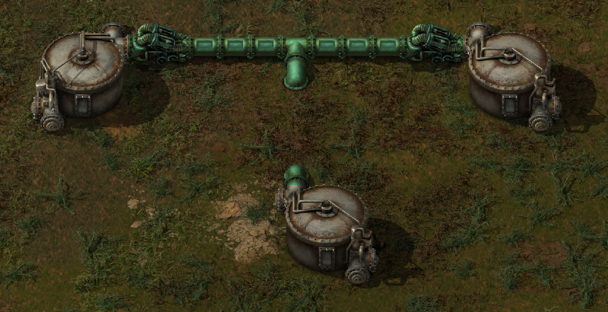
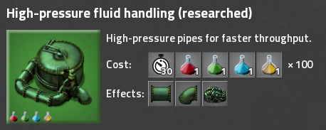
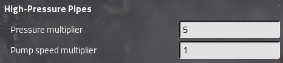

# High-Pressure Pipes

High-Pressure Pipes adds high-pressure variants of pipes and pumps, to allow fluids to flow faster and farther. This is especially useful with mods with faster factories and modules, such as bob's.

In vanilla, it adds upgrades based on the standard pipe and pump. If you have bob's mods installed, the upgrades are based on the highest tier of pipe and pump.

## Screenshots

### Entities

### Items

### Technology

### Mod settings
